# gfunk

Free your Drive, and your Workspace will follow — a CLI and an MCP server. Google-only by design.

It exists to do what a general assistant's built-in Gmail/Calendar/Drive connectors can't:
**Sheets and Docs, bulk analytical reads, cross-service joins, and writes.**

## Security and privacy

**gfunk ships zero credentials.** You register your own Google Cloud project, create your own
OAuth client, and supply your own `credentials.json`. Nothing in this repo grants access to
anything.

- Config lives at `~/.config/gfunk/` — never in the repo. The cached token is written `0600`.
- Scopes start at **read-only** (`spreadsheets.readonly`, `drive.readonly`) and widen only
  deliberately; a test asserts the exact list, so a widening cannot land unnoticed.
- `credentials.json`, `token.json` and `.env` are gitignored, and `gitleaks` +
  `detect-private-key` run on every commit as the backstop.
- **Test fixtures are the real leak risk here**, not secrets — a real customer name, address
  or spreadsheet ID in a fixture is a PII commit that no secret scanner will catch. Fixtures
  must be synthetic. The `block-private-terms` hook is the machine-side half of that rule.

Found a security issue? Open a GitHub security advisory rather than a public issue.

## Install

```bash
uv sync
```

## Usage

First run, once per machine:

```bash
gfunk mount-up                              # guided: create your OAuth client, then sign in
```

`mount-up` prints the five Google Cloud console screens (with direct links — pass
`--project <id>` to point them at your project), finds the downloaded
`client_secret*.json` in your Downloads folders, checks it is a **Desktop app** client,
installs it to `~/.config/gfunk/credentials.json` mode 0600, and offers to sign you in.
`gfunk setup` is an alias, since that is what people type blind. Off a TTY it prints the
walkthrough and the scriptable form, `gfunk mount-up --client-secrets <file>`.

Calendar access is opt-in and separate: add `--with-calendar` to request it —
`gfunk mount-up --with-calendar`. Without the flag, gfunk never asks Google for
Calendar scope, and `gfunk grind` tells you to re-run with it.

Already have a token? Everything else just works:

```bash
gfunk snoop                                 # walk your Drive folders (TUI, preview pane)
gfunk snoop <file-id>                       # read a Doc or Sheet in the terminal
gfunk snoop <file-id> --open                # open a Drive file in your browser
gfunk snoop <sheet-id> 'Sheet1!A1:D50'      # interactive spreadsheet viewer (TUI)
gfunk snoop <file-id> --peek                # quick non-interactive preview (used by browse too)
gfunk vibe                                  # pick a recent spreadsheet (fzf), then open the TUI
gfunk vibe <sheet-id> 'Sheet1!A1:D50'       # same as snoop, but sheets-only shortcut
gfunk bounce <file-id> --format csv         # export to CSV, JSON, txt, etc.
gfunk regulate                              # audit who can see your files
gfunk dubs                                  # find duplicate files you own
gfunk dj                                    # open Apps Script dashboard
gfunk mothership                            # start the MCP server on stdio
```

Every command prints JSON on stdout and the replayable invocation on stderr, so
`gfunk snoop x | jq` works and the echoed line is safe to paste into a script.

Run any of them with arguments missing and you'll be prompted — except off a TTY, where
gfunk names the missing flag and exits rather than hanging a CI job.

### As an MCP server

```json
{
  "mcpServers": {
    "gfunk": { "command": "uv", "args": ["run", "--project", "/path/to/gfunk", "gfunk", "mothership"] }
  }
}
```

Tools are namespaced `gfunk__snoop`, `gfunk__sample`, `gfunk__regulate`, `gfunk__dubs`, `gfunk__peep`. **stdio only** — an HTTP
listener holding live Workspace credentials is attack surface this project doesn't need yet.

### The local cache

Bulk reads land in a SQLite database at `~/.local/share/gfunk/cache.db`, created `0600`.
SQLite rather than Parquet: stdlib, queryable without a second engine, and one file that can
be chmod-ed. It holds real Workspace content, so it lives outside the repo and is never
committed.

```bash
sqlite3 ~/.local/share/gfunk/cache.db \
  "SELECT service, kind, count(*) FROM records GROUP BY 1, 2"
```

## The vocabulary

| Command | Alias | What it does |
|---|---|---|
| `mount-up` | `setup`, `login` | Guided first-run: create OAuth client, sign in |
| `snoop` | `browse` | Walk folders, read files, view sheets — your Drive window (TUI with a live preview pane) |
| `vibe` | `sheet` | Open a spreadsheet in the interactive viewer (TUI) — bare call fzf-picks from recent spreadsheets |
| `bounce` | `export` | Export (Sheets→CSV/JSON, Docs→txt/html) |
| `regulate` | `audit` | Audit who can reach the Drive files you own |
| `dubs` | `duplicates` | Find duplicate files you own — exact hash matches, plus same-name Docs/Sheets to check by hand. TUI picker lets you keep one copy and trash the rest |
| `holla` | `email` | Browse Gmail labels/messages (TUI): counts, drill in, archive a message to Drive as a long-term PDF (filed by year) — or, from the label view, archive a whole label at once, filed together in one folder by label name — filter by sender/subject, sort by size, open in browser, preview body (`tab` to scroll it with j/k), delete (trash), delete an empty label; `--label`/`--term`/`--json` for scripting |
| `dj` | `scripts` | List your Apps Script projects, recent runs, pull/push source, or open one (triggers still browser-based) |
| `mothership` | `mcp` | Start the MCP server on stdio |
| `grind` | `agenda` | Next week's Calendar events — `--since DAYS` also reaches backwards, for reviewing a week that already happened. Opt-in: run `gfunk mount-up --with-calendar` first — without it, no Calendar scope is ever requested |

### snoop — Drive browser

**Folder browser** — folders, docs, sheets with dates:

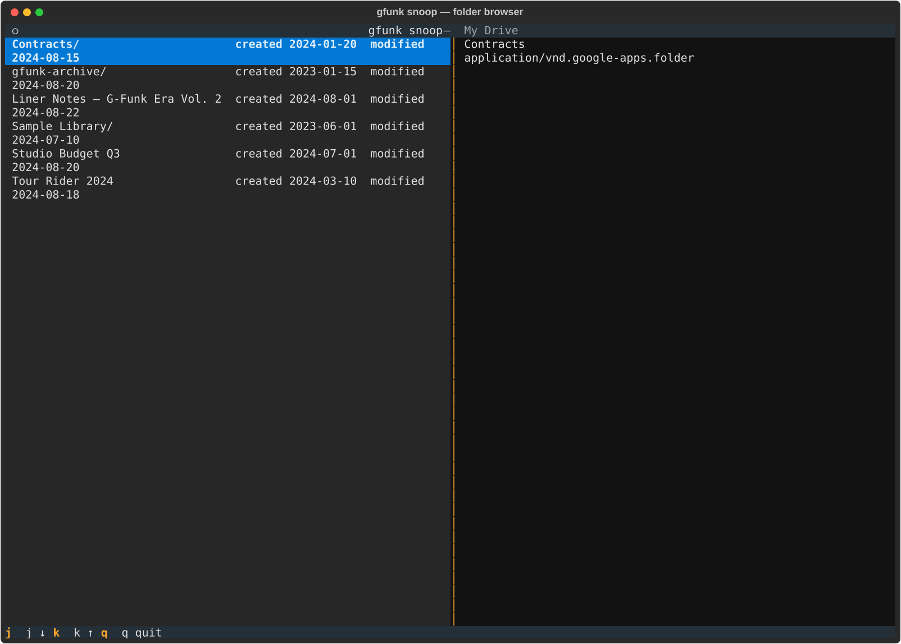

**Preview pane** — select a file to see its content:

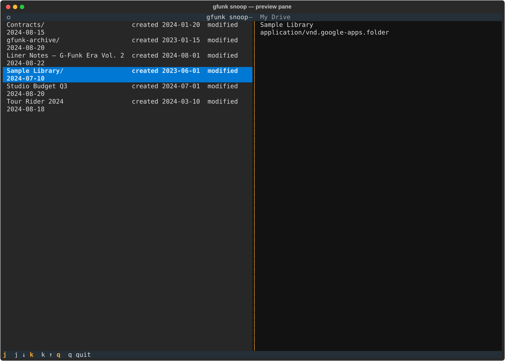

### vibe — spreadsheet viewer

**Spreadsheet view** — navigate with h/j/k/l, zebra stripes:

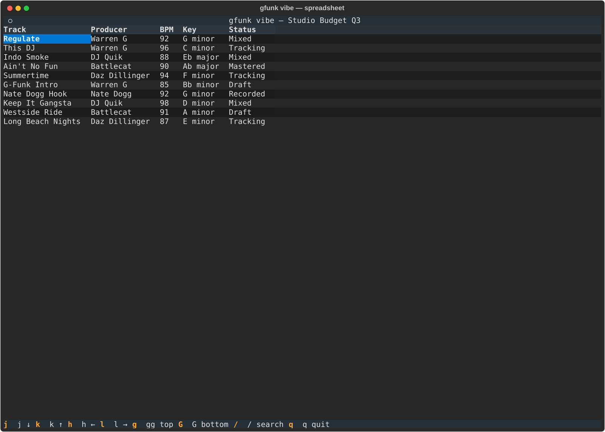

**Search** — filter rows by any column:

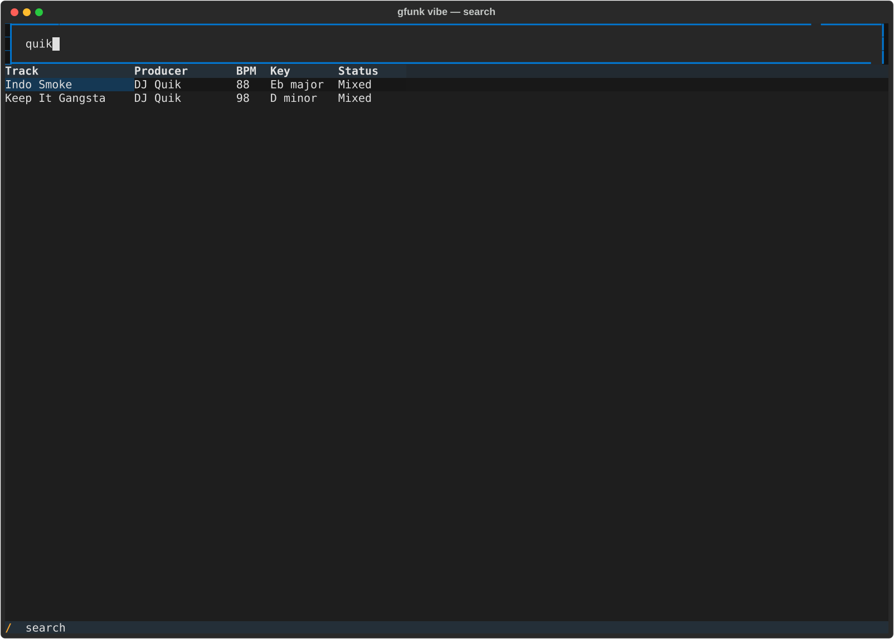

### regulate — permission audit

**Audit view** — files grouped by folder, exposure level, who can see them:

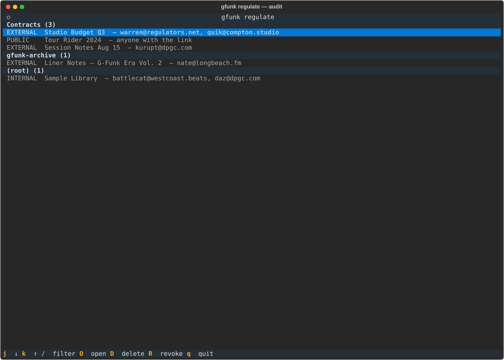

### dubs — duplicate finder

**Duplicates view** — grouped by match type, keep/delete/open:

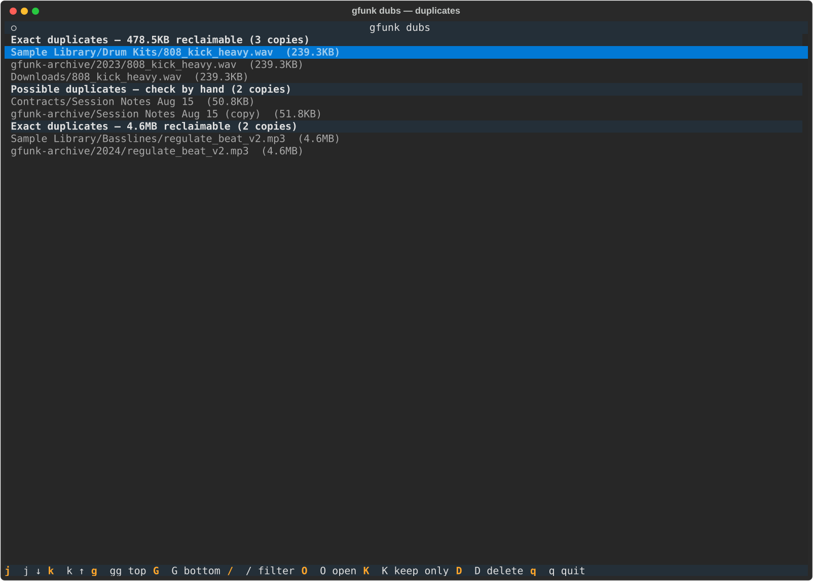

### holla — Gmail browser

**Labels view** — drill into any label to see messages:

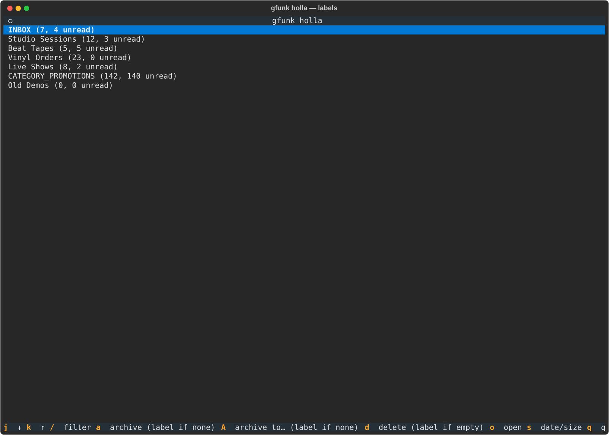

**Messages view** — filter, sort, archive, delete:

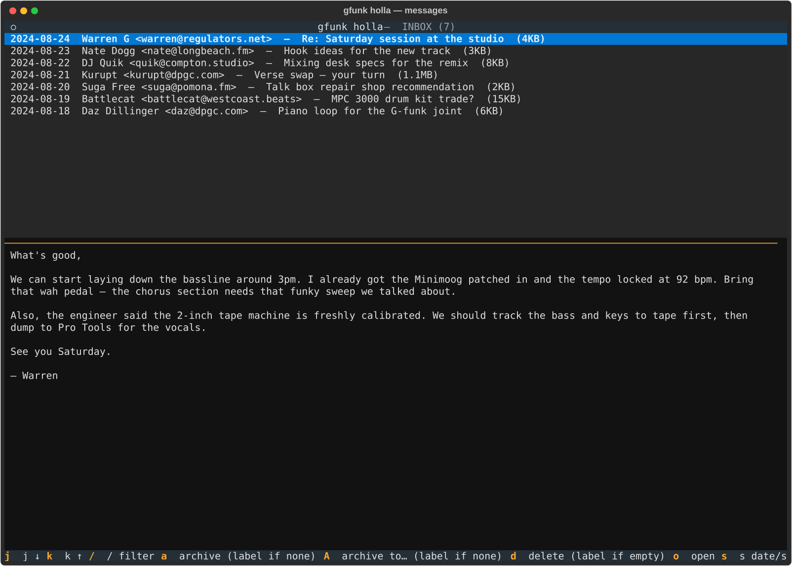

**Preview pane** — tab to open, j/k to scroll:

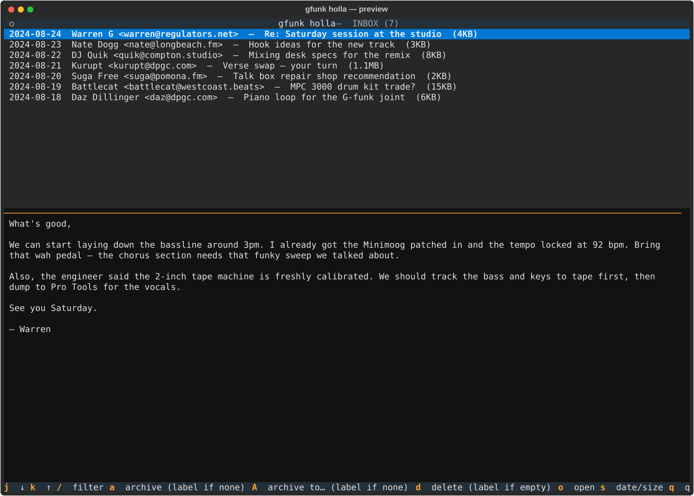

**Filter** — narrow by sender or subject:

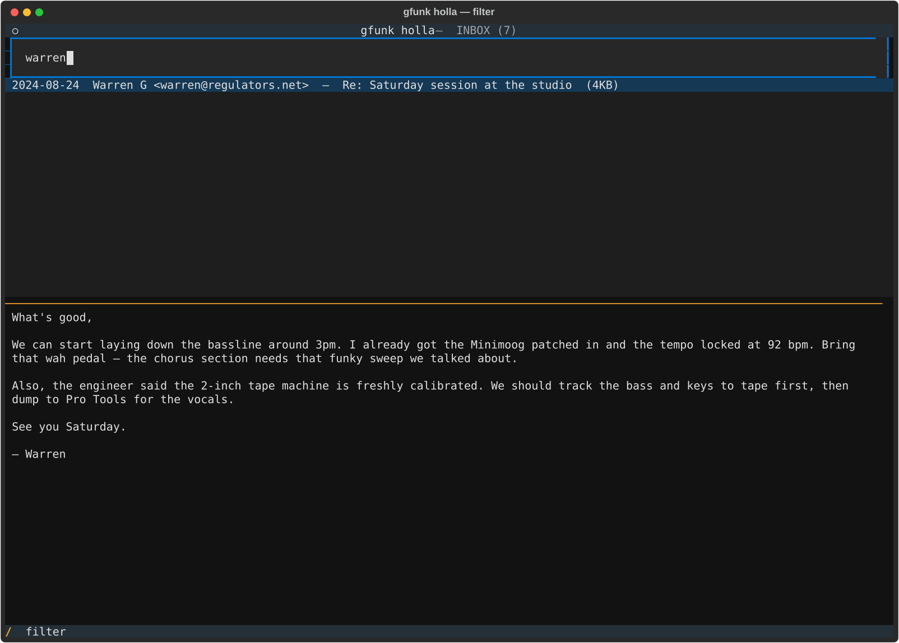

**Sort by size** — find the big ones:

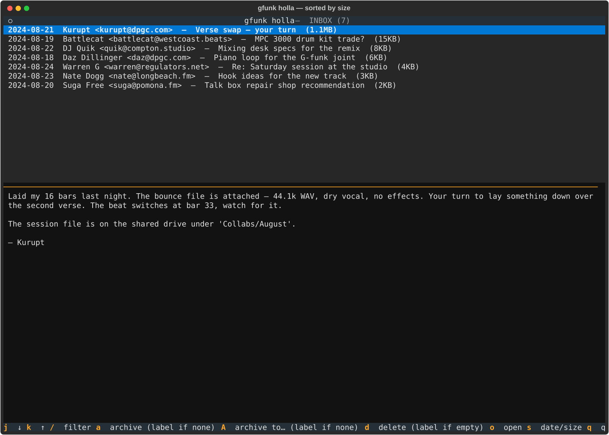

### grind — calendar agenda

**Week view** — time bars, load indicators, conflict warnings:

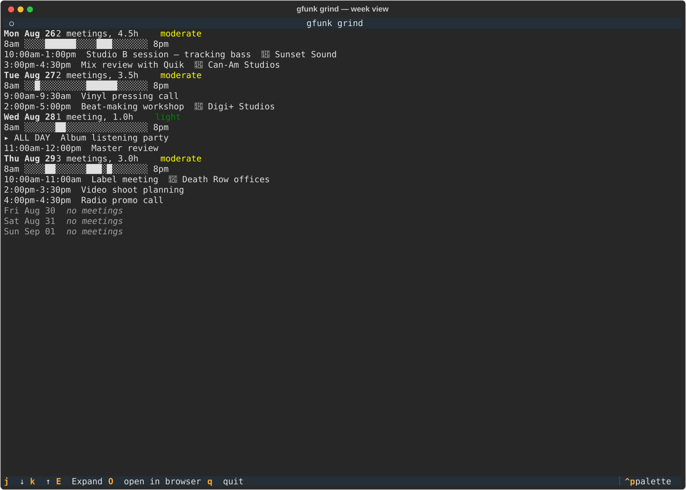

**Expanded event** — attendees, location, duration:

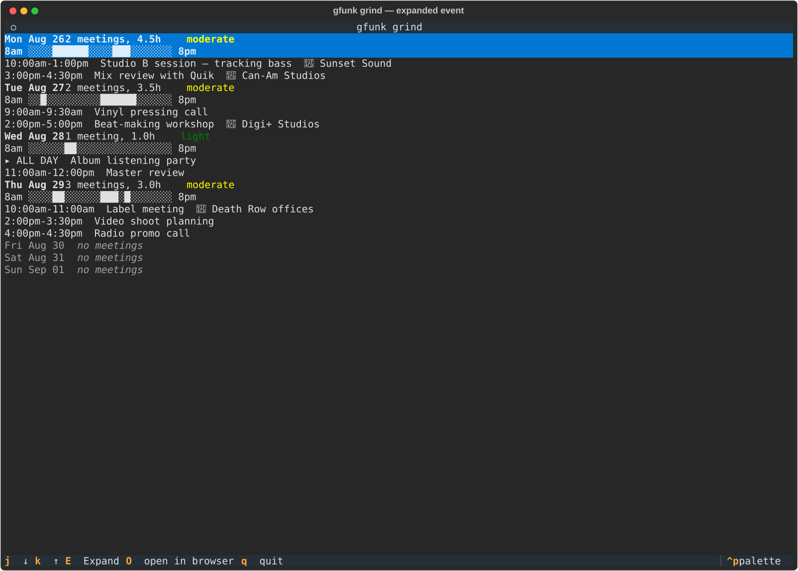

## Development

```bash
uv sync
uv run pytest
pre-commit install
```

<!-- tree:start -->

```
gfunk/
|-- .claude/
|   |-- CLAUDE.md
|   `-- settings.json
|-- .github/
|   |-- workflows/
|   |   `-- ci.yml
|   `-- dependabot.yml
|-- docs/
|   `-- screenshots/
|       |-- dubs_groups.svg
|       |-- grind_expanded.svg
|       |-- grind_week.svg
|       |-- holla_filter.svg
|       |-- holla_labels.svg
|       |-- holla_messages.svg
|       |-- holla_preview.svg
|       |-- holla_sorted.svg
|       |-- regulate_audit.svg
|       |-- snoop_browse.svg
|       |-- snoop_preview.svg
|       |-- vibe_search.svg
|       `-- vibe_table.svg
|-- scripts/
|   `-- capture_screenshots.py
|-- src/
|   `-- gfunk/
|       |-- __init__.py
|       |-- __main__.py
|       |-- auth.py
|       |-- bootstrap.py
|       |-- browser.py
|       |-- cache.py
|       |-- cli.py
|       |-- demo_data.py
|       |-- dubs.py
|       |-- dubs_tui.py
|       |-- errors.py
|       |-- gmail.py
|       |-- grind_tui.py
|       |-- holla_tui.py
|       |-- mcp_config.py
|       |-- mothership.py
|       |-- mothership_config.py
|       |-- regulate.py
|       |-- regulate_tui.py
|       |-- snoop_tui.py
|       |-- vibe.py
|       `-- workspace.py
|-- tests/
|   |-- conftest.py
|   |-- test_auth.py
|   |-- test_bootstrap.py
|   |-- test_browser.py
|   |-- test_cache.py
|   |-- test_cli.py
|   |-- test_cli_bounce.py
|   |-- test_cli_dj.py
|   |-- test_cli_dj_list.py
|   |-- test_cli_drop.py
|   |-- test_cli_dubs.py
|   |-- test_cli_grind.py
|   |-- test_cli_holla.py
|   |-- test_cli_mount_up.py
|   |-- test_cli_peep.py
|   |-- test_cli_peep_open.py
|   |-- test_cli_regulate.py
|   |-- test_cli_sample.py
|   |-- test_cli_snoop_delete.py
|   |-- test_cli_snoop_move.py
|   |-- test_cli_snoop_peek.py
|   |-- test_cli_snoop_walk.py
|   |-- test_cli_vibe.py
|   |-- test_cli_vibe_command.py
|   |-- test_dubs.py
|   |-- test_dubs_tui.py
|   |-- test_errors.py
|   |-- test_gmail.py
|   |-- test_grind_render.py
|   |-- test_grind_tui.py
|   |-- test_holla_tui.py
|   |-- test_mcp_config.py
|   |-- test_mothership.py
|   |-- test_mothership_config.py
|   |-- test_regulate.py
|   |-- test_regulate_tui.py
|   |-- test_snoop_tui.py
|   |-- test_workspace.py
|   |-- test_workspace_gmail.py
|   |-- test_workspace_script_files.py
|   `-- test_workspace_scripts.py
|-- .gitignore
|-- .pre-commit-config.yaml
|-- .ruff.toml
|-- LICENSE
|-- pyproject.toml
|-- README.md
`-- uv.lock
```

<!-- tree:end -->
